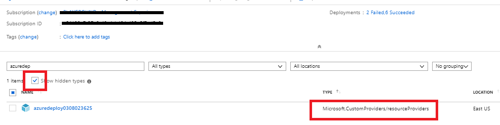
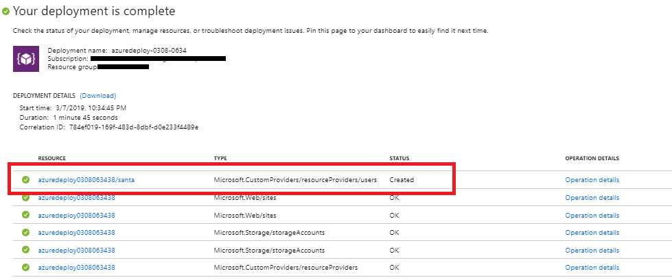

# Creating a Custom Provider to connect SharePoint Online with Azure

<a href="https://portal.azure.com/#create/Microsoft.Template/uri/https%3A%2F%2Fraw.githubusercontent.com%2Fmshimanshuchandel%2fSharePointCustomRP%2Fmaster%2F101-custom-rp-sharepoint-integration-with-function%2Fazuredeploy.json" target="_blank">
    
</a>
<a href="http://armviz.io/#/?load=https%3A%2F%2Fraw.githubusercontent.com%2Fmshimanshuchandel%2fSharePointCustomRP%2Fmaster%2F101-custom-rp-sharepoint-integration-with-function%2Fazuredeploy.json" target="_blank">
    
</a>

This sample template deploys a custom resource provider to Azure which connects Azure with SharePoint Online allowing creation and deletion of SharePoint sites, creation and deletion of events in an events list within the sites. You may optionally deploy the function app and custom provider definition - this only needs to be done once and then the custom resource can be deployed many times.

The customproviders resource is a hidden Azure resource so to confirm that the resource provider has been deployed you will have to check the box that says *Show hidden types* in the Azure portal Overview page for the resource group.



## Details on the custom resource provider created

This sample deployment creates the following two apis on the resource.

1) An ARM extended resource called "sites"
2) An ARM extended resource called "events"

### Sites

The sites resource is defined in the following part of the ARM template : 

```json
"resourcetypes": [
                    {
                        "name": "sites",
                        "routingType": "Proxy,cache",
                        "endpoint": "[concat('https://', parameters('funcname'), '.azurewebsites.net/api/{requestPath}')]"
                    }
                ],
```

In the above template we can see that the resource "sites" has been defined as a Proxy resource which means that it is backed by a REST api endpoint. The details of the endpoint come next. The endpoint uri in the section refers to the endpoint that implements this resource. When the resource is defined as above, the resource will support all CRUD calls like "GET", "PUT", "DELETE" etc and it is expected that the endpoint has implemented them. In the above case this means that we will be able to make the following calls on ARM:

```
PUT/GET/DELETE /subscriptions/{subscriptionid}/resourceGroups/{resourcegroup}/providers/Microsoft.CustomProviders/resourceProviders/{customrpname}/sites/siteName?<api-version>
```

You can see this in action in the last part of the template where we create this new user type : 

```json
    {
        "type": "Microsoft.CustomProviders/resourceProviders/sites",
        "name": "[concat(parameters('funcName'), '/samplecustomersite')]",
        "apiVersion": "2018-09-01-preview",
        "location": "[parameters('location')]",
        "dependsOn": [
            "[resourceId('Microsoft.CustomProviders/resourceProviders', parameters('funcName'))]"
        ],
        "properties": {
            "title": "[parameters('sampleSiteTitle')]",
            "description": "[parameters('samplecustomersiteDescription')]"
        }
    }
```

Navigating to the deployment details on the templatedeployment will show a new resource type called resourceproviders/sites created on the custom resource provider with the name samplecustomersite


To confirm that the site has been created , you can use a rest api client such as postman and run the following query and see the results and also navigate to SharePoint online to see the new site created:

```
GET  
https://management.azure.com/subscriptions/{subscriptionid}/resourceGroups/{resourcegroup}/providers/Microsoft.CustomProviders/resourceProviders/{customrpname}/sites/samplecustomersite?api-version=2018-09-01-preview
```

You can also create/delete additional sites.

### Events

In addition to sites, this template also defines an events resource in the following part of the template. 

```json
"resourceTypes": [
    {
        "name": "events",
        "routingType": "Proxy,cache",
        "endpoint": "[concat('https://', parameters('funcname'), '.azurewebsites.net/api/{requestPath}')]"
    }
]
```

The format for this action is similar to the resource type defined above , but since this is an action this call will only support POST methods as follows:

```
PUT/GET/DELETE /subscriptions/{subscriptionid}/resourceGroups/{resourcegroup}/providers/Microsoft.CustomProviders/resourceProviders/{customrpname}/events/eventName?<api-version>
```

The code that enables this process is all implemented as part of the azure function that is deployed along with the template. To further understand how the function has been configured please look here:

+ [**Creating an azure function**](SampleFunctions/CSharpSimpleProvider/README.md)
